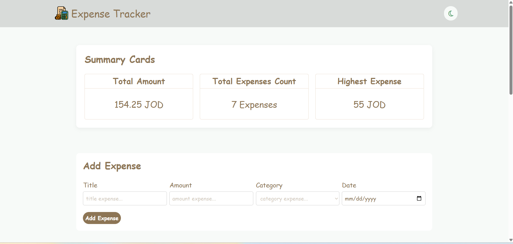
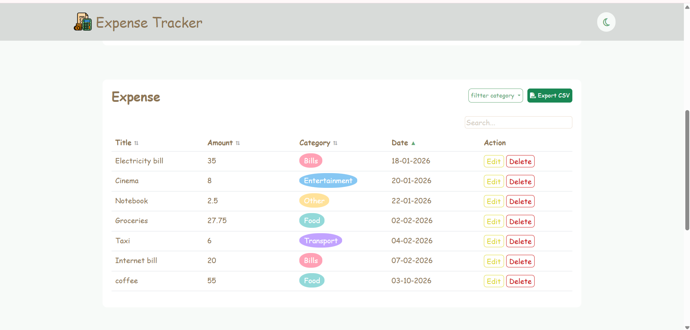
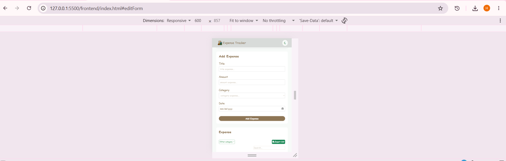
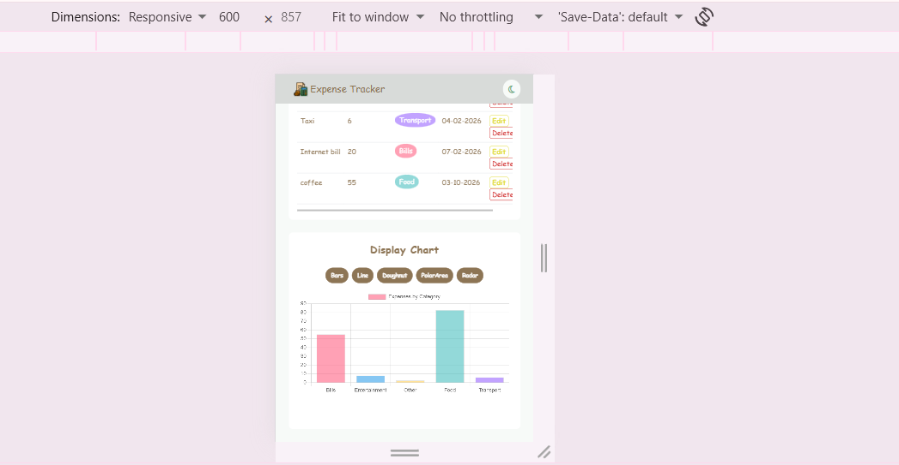

# Expense Tracker

A web-based expense management application designed to help users easily track, 
categorize, and visualize their daily spending with form validation and real-time summaries.

## How to run

<!-- Write the exact steps someone needs to run your project from scratch.
     Assume they have Node.js, PostgreSQL, and VS Code, and nothing else.
     Include: creating the database, running schema.sql, writing the .env file,
     starting the backend, and opening the frontend. -->

**Backend**

1. Navigate to the backend folder and install the required packages (express, pg, dotenv, cors):
npm install express pg dotenv cors

2. Ensure the following are installed on your machine:
     1. [Node.js]
     2. [PostgreSQL]

**Database**
1. Create a PostgreSQL database named [expense_tracker] using pgAdmin, then execute the [schema.sql] file to set up the tables.

2. Create a [.env] file in the backend root folder and configure the database settings and port:

3. Code Snippet
     PORT=3000
     DB_USER=postgres
     DB_HOST=localhost
     DB_NAME=expense_tracker
     DB_PASSWORD=your_password
     DB_PORT=5432

4. Start the backend server:
     node server.js

**Frontend**

1. Open the frontend folder in VS Code.

2. Install and use the "Live Server" extension, then right-click the `index.html` file and select "Open with Live Server"

## Features

- [ ] Add an expense (with validation)
- [ ] Delete an expense
- [ ] Edit an expense
- [ ] Filter by category
- [ ] Summary cards (total, count, highest)
- [ ] Data is saved in a PostgreSQL database
- [ ] Expense chart by category (Chart.js)
- [ ] Filter by month or search by title
- [ ] Sort table by clicking column headers
- [ ] Export expenses as a CSV file
- [ ] Dark Mode

## Screenshots

## What was the hardest part?

The most challenging part was dynamically managing and aggregating total amounts by category for charts and UI summaries, without relying on complex external charting libraries. We initially encountered an issue where individual expense items were displayed separately instead of being grouped by category; we resolved this by implementing a grouping loop (using a [categoryMap]) in JavaScript to seamlessly aggregate amounts by category before rendering them.

## Github:
https://github.com/Heba62/expense-tracker-starter.git

## Google Drive

